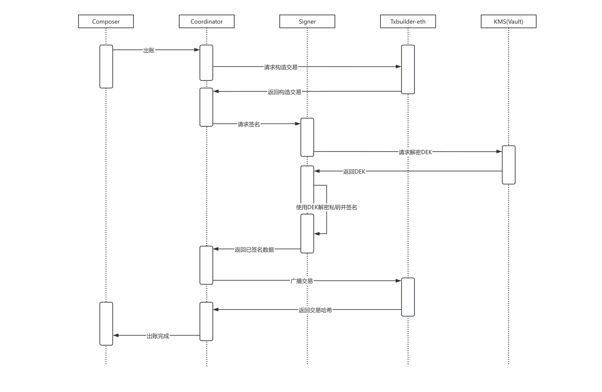

# Go-Koku

Go-Koku 致力于为区块链交易提供安全、高效、模块化的密钥管理与签名解决方案，适用于多种链和应用场景。


- **Composer：** 整个系统的入口，负责 ACL 与外部系统通讯，除此之外它还会做一些统筹决策，如：出账时负责挑选合适的地址作为`from`地址、资金不足调用其他服务进行归集等。
- **Coordinator：** 系统的调度中心，负责协调各模块的调用流程，统一处理外部请求分发和业务路由。例如：在转账中，它负责协调构造交易、签名、广播等操作。
- **Key Creator：** 专注于密钥生成，支持多种算法和 HD（层级确定性）钱包派生规范，实现密钥的创建操作。
- **Signer：** 提供高安全性的交易签名服务，隔离签名操作，确保私钥不出服务边界，并支持多个区块链与签名算法。
- **TxBuilder：** 负责处理不同区块链的交易构建、序列化和规范化，确保签名前的交易结构正确且合规。每个区块链对应一个 txBuilder 服务。
- **KMS：** 基于外部密钥管理系统（如 HashiCorp Vault、AWS KMS），负责密钥加密存储与权限管理，并支持扩展 HSM。为上层服务（Key Creator 和 Signer）提供统一的密钥操作接口。

---


## 交易流程

下图展示了整个系统是如何协助出账：

## 


## 服务详解


### 1. Coordinator（协调器）

[了解项目详情 internal/coordinator/README.md](internal/coordinator/README.md)

### 2. KeyCreator（密钥生成服务）

[了解项目详情 internal/key-creator/README.md](internal/key-creator/README.md)

### 3. Signer（签名服务）

[了解项目详情 internal/signer/README.md](internal/signer/README.md)

### 4. KMS（密钥管理服务）

[了解项目详情 internal/kms-vault/README.md](internal/kms-vault/README.md)

### 5. Txbuilder（交易构造服务）

- [txbuilder-ethereum](https://github.com/koku-web3/txbuilder-ethereum)


## 安全设计

### 密钥安全

1. **最小暴露原则**：私钥明文仅在签名/生成瞬间存在于内存
2. **内存清零**：使用后立即擦除敏感数据
3. **Vault Transit Engine**：所有密钥静态加密存储
4. **BIP-44 派生**：支持无限子密钥，无需暴露主密钥

### 传输安全

1. **AWS IAM 认证**：KeyCreator/Signer 与 Vault 之间的认证
2. **TLS**：服务间的 gRPC 通信均强制启用 mTLS 双向认证，详见 [mTLS 配置指南](docs/mtls.md)。


### 审计追踪

1. **AuditLog 表（简单版）**：记录所有密钥操作
2. **TraceID**：全链路追踪

---


## Docker 启动流程


### 架构说明

Docker Compose 部署包含以下服务：


| 服务            | 端口          | 说明            |
| ------------- | ----------- | ------------- |
| `mysql`       | 3306        | MySQL 8.0 数据库 |
| `rabbitmq`    | 5672, 15672 | RabbitMQ 消息队列 |
| `coordinator` | 50051       | 协调器服务         |
| `signer`      | 50052       | 签名服务          |
| `key-creator` | 50053       | 密钥生成服务        |


> **注意**：TxBuilder 服务为外部依赖，需要自行部署或修改配置指向现有服务。


### 启动步骤


#### 1. 生成 mTLS 证书

```bash
./scripts/gen-certs.sh
```

#### 2. 部署并启动 KMS

[查看部署文档](internal/kms-vault/README.md)


#### 3. 启动服务

```bash
docker compose up -d --build
```

#### 4. 停止服务

```bash
# 停止所有服务（保留数据卷）
docker compose down

# 停止并删除数据卷（清空数据）
docker compose down -v
```

---


## License

MIT License