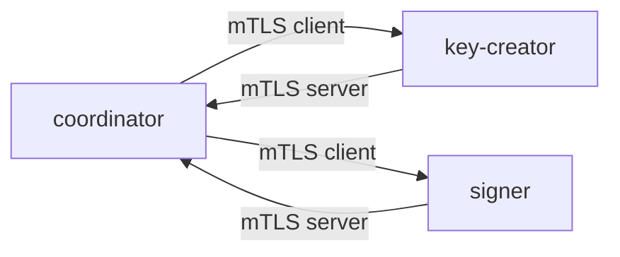

# mTLS 配置指南

## 概述

go-koku 所有 gRPC 服务之间的通信均使用双向 TLS（mTLS）进行加密和双向认证。

- **服务端**：必须提供服务端证书，强制验证客户端证书（`ClientAuth = RequireAndVerifyClientCert`）。
- **客户端**：必须提供客户端证书，验证服务端证书（`ServerName` 校验）。
- **CA**：所有证书由统一的自签 CA 签发，CA 证书在所有节点间共享。

## 调用关系与 TLS 角色



| 调用方 | 被调用方 | 角色 |
|--------|---------|------|
| coordinator | key-creator | 客户端 |
| coordinator | signer | 客户端 |
| key-creator | coordinator | 服务端 |
| signer | coordinator | 服务端 |

## 证书目录结构

```
certs/
├── ca/
│   └── ca.pem                 # 自签 CA 证书（所有节点共享）
└── server/
    ├── key-creator.pem/.key  # key-creator 服务端证书
    ├── signer.pem/.key       # signer 服务端证书
    └── coordinator.pem/.key   # coordinator 同时用作服务端和客户端的证书
```

> coordinator 服务端和客户端共用 `coordinator.pem/.key`，无需单独的 `client/` 目录。

## 生成证书

首次部署前，运行证书生成脚本：

```bash
./scripts/gen-certs.sh
```

脚本使用 `openssl` 生成：
- 自签 CA（10年有效期）
- 三个服务端证书（CN = `key-creator` / `signer` / `coordinator`，含 SAN）
- 一个客户端证书（CN = `coordinator-client`，含 `extendedKeyUsage = clientAuth`）

所有产物放在项目根目录 `certs/` 下。**私钥文件（`.key`）不要提交到版本库**（已通过 `.gitignore` 排除）。

## 配置文件说明

### 服务端配置（key-creator / signer / coordinator 各自的服务端）

```toml
[tls]
enable = true
ca_cert_file = "/etc/koku/certs/ca/ca.pem"
server_cert_file = "/etc/koku/certs/server/<name>.pem"
server_key_file = "/etc/koku/certs/server/<name>.key"
```

### 客户端配置（coordinator 作为客户端访问下游服务）

coordinator 共用 `[tls]` 中的同一套证书，只需指定 `server_name` 指向下游服务的证书 CN：

```toml
[keycreator.tls]
server_name = "key-creator"

[signer.tls]
server_name = "signer"
```

> `server_name` 必须与服务端证书的 CN 或 SAN 完全一致，否则 TLS 握手会失败。

## Docker Compose 部署

容器内路径统一为 `/etc/koku/certs/`，通过 docker-compose 挂载：

```yaml
volumes:
  - ./certs:/etc/koku/certs:ro
```

确保运行前先执行 `./scripts/gen-certs.sh` 生成证书。

## 证书轮换流程

### 服务端证书轮换

1. 用新私钥生成 CSR（证书签名请求）
2. 用 CA 签发新证书
3. 替换 `server/*.pem` 和 `server/*.key`（保持文件名不变）
4. 滚动重启服务（无需更新配置）

### 客户端证书轮换

1. 生成新客户端私钥和 CSR
2. 用 CA 签发新证书
3. 替换 `client/coordinator.pem` 和 `client/coordinator.key`
4. 滚动重启 coordinator（无需更新配置）

### CA 轮换（较少见）

1. 生成新 CA 私钥和自签证书
2. 用新 CA 重新签发所有服务端和客户端证书
3. 更新所有服务的 CA 证书文件（`ca/ca.pem`）
4. 全量重启所有服务

## 验证 mTLS 握手

使用 `openssl s_client` 验证与服务端的连接：

```bash
# 验证 key-creator 服务端（需提供客户端证书）
openssl s_client -connect localhost:50053 \
  -cert certs/client/coordinator.pem \
  -key certs/client/coordinator.key \
  -CAfile certs/ca/ca.pem

# 验证 signer 服务端
openssl s_client -connect localhost:50052 \
  -cert certs/client/coordinator.pem \
  -key certs/client/coordinator.key \
  -CAfile certs/ca/ca.pem
```

看到 `Verify return code: 0 (ok)` 即表示 mTLS 握手成功。
