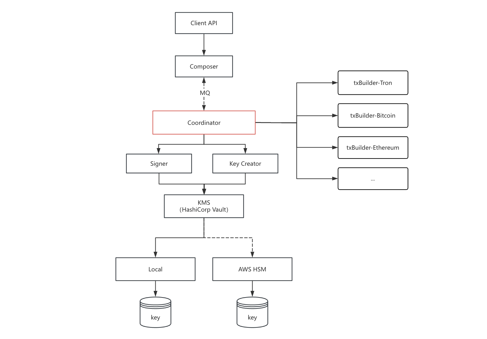

# Coordinator

## 概述

Coordinator 是一个接收上游请求并协调下游服务完成区块链操作的中间服务。它屏蔽了不同区块链的实现细节，上游服务只需传入 `chainCode` 指定目标链，无需关心链的具体实现。

**支持的链操作**：

- 创建密钥
- 校验地址合法性
- 查询地址余额
- 转账（通用转账，支持主链币和 ERC20 代币）
- 转账（UTXO转账）

**工作原理**：

Coordinator 内部通过分析请求，协调下游服务完成任务：

1. **KeyCreator**：生成密钥对
2. **TxBuilder**（每链部署一个）：校验地址/余额、构造交易、广播交易
3. **Signer**（→ KMS）：签名交易



**典型流程 - UniversalTransfer 转账**：

1. 上游请求 `UniversalTransfer`，入参 `chainCode=ethereum`
2. Coordinator 调用 `txBuilder-ethereum` 校验地址和余额
3. Coordinator 向 `txBuilder-ethereum` 请求"构造交易"，得到"代签名数据"
4. Coordinator 将签名数据发送至 Signer 服务（Signer → KMS）完成签名
5. Coordinator 将签名数据回传至 `txBuilder-ethereum` 广播交易
6. Coordinator 得到`txHash`返回调用方，交易完成

**其他特性**：

- 异步处理：RabbitMQ 消息队列支持高并发转账请求
- 审计日志：记录所有密钥操作，满足合规要求


## 目录结构

```
internal/coordinator/
├── config/
│   └── config.go           # 配置加载与校验
├── grpc/
│   └── server.go           # gRPC Server 实现
├── types/
│   ├── key.go              # 密钥相关类型定义
│   └── transfer.go         # 转账相关类型定义
├── model/
│   └── key.go              # GORM 数据库模型 (Chain, CoreKey, MasterKey, ChindKey, AuditLog)
├── repository/
│   └── key_repository.go   # 数据库访问层
├── service/
│   ├── key_service.go      # 密钥管理服务 (实现 KeyManager 接口)
│   └── transfer_service.go # 转账服务 (实现 TransferManager 接口)
├── key/
│   ├── keymanager.go       # KeyManager 接口定义
│   └── errors.go           # 密钥操作错误类型
├── tx/
│   ├── transfer.go         # TransferManager 接口定义
│   └── errors.go           # 转账操作错误类型
├── mq/
│   ├── consumer.go         # RabbitMQ 消费者
│   ├── handler.go          # 消息处理器
│   ├── router.go           # 路由键解析
│   ├── config.go           # MQ 配置
│   └── errors.go           # MQ 错误类型
└── infra/                 # 外部服务客户端
    ├── signer/             # Signer 服务 gRPC 客户端 (mTLS)
    ├── keycreator/         # KeyCreator 服务 gRPC 客户端 (mTLS)
    ├── txbuilder/          # TxBuilder 服务 gRPC 客户端 (熔断器支持)
    ├── db/                 # MySQL 数据库连接
    └── setup/              # 依赖注入与初始化
```

**Proto 文件**: `proto/coordinator.proto`

**gRPC 服务地址**: `{host}:{port}`

**认证方式**: mTLS 双向认证（服务端和客户端证书复用）

---

> 注意：在开始前，请确认 KMS 服务器已部署成功。未部署请转到[HashiCorp Vault 部署与配置](../kms-vault/README.md)。

## 1. gRPC 接口

### 1.1 服务定义

```protobuf
service Coordinator {
  // 健康检查
  rpc HealthCheck(HealthCheckRequest) returns (HealthCheckResponse);

  // 生成核心主密钥
  // 调用 KeyCreator 服务生成 HD 主密钥及其派生的核心密钥
  rpc Genesis(GenesisRequest) returns (GenesisResponse);

  // 创建运营密钥
  rpc CreateOperationalKey(CreateKeyRequest) returns (CreateKeyResponse);

  // 创建用户密钥
  rpc CreateUserKey(CreateKeyRequest) returns (CreateKeyResponse);

  // 校验地址是否合法
  rpc VerifyAddress(VerifyAddressRequest) returns (VerifyAddressResponse);

  // 校验合约地址是否合法
  rpc VerifyContractAddress(VerifyContractAddressRequest) returns (VerifyContractAddressResponse);

  // 检查地址是否有足够的余额转账
  // 支持检查合约余额
  rpc CheckSufficientBalance(CheckSufficientBalanceRequest) returns (CheckSufficientBalanceResponse);

  // 通用转账
  // 非UTXO，具有出账地址、入账地址、金额、合约地址等普遍通用的转账
  rpc UniversalTransfer(UniversalTransferRequest) returns (UniversalTransferResponse);
}
```

---


### 1.2 接口说明

#### 1.2.1 健康检查

**功能**: 检查服务运行状态

```protobuf
message HealthCheckRequest {}
message HealthCheckResponse { string status = 1; }
```

**响应示例**:

```json
{
    "status": "ok"
}
```

---

#### 1.2.2 Genesis 初始化

**功能**: 生成核心主密钥。调用 KeyCreator 服务生成 HD 主密钥及其派生的核心密钥（OPERATIONAL 和 USER），并保存到数据库。

**前置条件**: 该链尚未初始化（master_keys 和 core_keys 不存在）

**请求**:

```protobuf
message GenesisRequest {
  string trace_id = 1;   // 链路跟踪 ID，1-36 必填
  string chain_code = 2; // 区块链代码，1-36 必填
  string key_type = 3;   // 密钥类型，如 ecdsa-secp256k1、ecdsa-secp256r1、eddsa-ed25519，1-36 必填
}
```

**响应**:

```protobuf
message GenesisResponse {
  bool success = 1; // 执行结果
}
```

**请求示例**:

```bash
grpcurl -plaintext -d '{"trace_id":"tx-001","chain_code":"ethereum","key_type":"ecdsa-secp256k1"}' \
  localhost:50051 coordinator.Coordinator/Genesis
```

---


#### 1.2.3 创建运营密钥

**功能**: 创建运营密钥（OPERATIONAL），用于平台运营相关交易。密钥由 KeyCreator 服务生成，地址由 TxBuilder 服务转换。

**请求**:

```protobuf
message CreateKeyRequest {
  string trace_id = 1;   // 链路跟踪 ID，1-36 必填
  string chain_code = 2; // 区块链代码，1-36 必填
  int32 count = 3;       // 生成密钥数量，范围 1-50
}
```

**响应**:

```protobuf
message CreateKeyResponse {
  bool success = 1;                      // 执行结果
  repeated AddressInfo address_list = 2;  // 地址列表
}

message AddressInfo {
  uint32 account_index = 1; // 账户索引
  string address = 2;       // 区块链地址
}
```

**请求示例**:

```bash
grpcurl -plaintext -d '{"trace_id":"tx-002","chain_code":"ethereum","count":5}' \
  localhost:50051 coordinator.Coordinator/CreateOperationalKey
```

**响应示例**:

```json
{
    "success": true,
    "address_list": [
        { "account_index": 0, "address": "0x1234..." },
        { "account_index": 1, "address": "0x5678..." },
        { "account_index": 2, "address": "0x9abc..." }
    ]
}
```

---


#### 1.2.4 创建用户密钥

**功能**: 创建用户密钥（USER），用于用户相关交易。密钥由 KeyCreator 服务生成，地址由 TxBuilder 服务转换。

**请求参数** 与创建运营密钥相同。

**请求示例**:

```bash
grpcurl -plaintext -d '{"trace_id":"tx-003","chain_code":"ethereum","count":10}' \
  localhost:50051 coordinator.Coordinator/CreateUserKey
```

---


#### 1.2.5 校验地址

**功能**: 校验区块链地址是否合法。通过 TxBuilder 服务进行地址格式和校验和验证。

**请求**:

```protobuf
message VerifyAddressRequest {
  string trace_id = 1;
  string address = 2;
  string chain_code = 3;
}

message VerifyAddressResponse {
  bool is_valid = 1;
}
```

**请求示例**:

```bash
grpcurl -plaintext -d '{"trace_id":"tx-004","address":"0x1234...","chain_code":"ethereum"}' \
  localhost:50051 coordinator.Coordinator/VerifyAddress
```

**响应示例**:

```json
{
    "is_valid": true
}
```

---


#### 1.2.6 校验合约地址

**功能**: 校验合约地址是否合法。通过 TxBuilder 服务验证合约地址格式。

**请求**:

```protobuf
message VerifyContractAddressRequest {
  string trace_id = 1;
  string address = 2;
  string chain_code = 3;
}

message VerifyContractAddressResponse {
  bool is_valid = 1;
}
```

**请求示例**:

```bash
grpcurl -plaintext -d '{"trace_id":"tx-005","address":"0xContract...","chain_code":"ethereum"}' \
  localhost:50051 coordinator.Coordinator/VerifyContractAddress
```

---


#### 1.2.7 检查余额

**功能**: 检查地址是否有足够的余额进行转账。支持主链币和合约代币余额检查。

**请求**:

```protobuf
message CheckSufficientBalanceRequest {
  string trace_id = 1; // 1-36 必填
  string chain_code = 2; // 1-36 必填； 唯一， 表示区块链名称，如：bitcoin、ethereum、tron
  string coin = 3; // 必填； 唯一， 表示转账币种，如：btc、eth、usdt、dog；不涉及判断逻辑，仅作展示
  string from_address = 4; // 1-256 必填；转账发起地址
  string amount = 5; // 必填； 金额，单位是最小该链单位，如：以太坊单位就是wei；波场单位就是sun
  string contract = 6; // 1-256 非必填；转账币种对应的合约地址。如果空串表示主链币
}

message CheckSufficientBalanceResponse {
  bool is_coin_sufficient = 1;   // 主链币是否足够
  bool is_token_sufficient = 2; // 合约余额是否足够
}
```

**请求示例**:

```bash
grpcurl -plaintext -d '{
  "trace_id": "tx-006",
  "chain_code": "ethereum",
  "coin": "eth",
  "from_address": "0x1234...",
  "amount": "1000000000000000000"
}' localhost:50051 coordinator.Coordinator/CheckSufficientBalance
```

**响应示例**:

```json
{
    "is_coin_sufficient": true,
    "is_token_sufficient": true
}
```

---


#### 1.2.8 通用转账

**功能**: 执行通用转账（非 UTXO）。支持主链币和 ERC20 代币转账。验证地址、合约、余额后，通过 Signer 服务签名，TxBuilder 服务广播。

**请求**:

```protobuf
message UniversalTransferRequest {
  string trace_id = 1; // 1-36 必填
  string chain_code = 2; // 1-36 必填； 唯一， 表示区块链名称，如：bitcoin、ethereum、tron
  string coin = 3; // 必填； 唯一， 表示转账币种，如：btc、eth、usdt、dog；不涉及判断逻辑，仅作展示
  string from_address = 4; // 1-256 必填；转账发起地址 
  string to_address = 5; // 1-256 必填；转账接收地址
  string amount = 6; // 必填； 金额，单位是最小该链单位，如：以太坊单位就是wei；波场单位就是sun
  string contract = 7; // 1-256 非必填；转账币种对应的合约地址。如果空串表示主链币
}

message UniversalTransferResponse {
  bool ok = 1; // 已处理
}
```

**请求示例**:

```bash
grpcurl -plaintext -d '{
  "trace_id": "tx-007",
  "chain_code": "ethereum",
  "coin": "eth",
  "from_address": "0xFrom...",
  "to_address": "0xTo...",
  "amount": "1000000000000000000"
}' localhost:50051 coordinator.Coordinator/UniversalTransfer
```

---


### 1.3 客户端调用示例


#### Go 客户端

```go
import (
    proto "github.com/koku-web3/go-koku/pkg/proto/coordinator"
    "google.golang.org/grpc"
    "google.golang.org/grpc/credentials"
)

func main() {
    // TLS 连接配置
    creds := credentials.NewTLS(&tls.Config{
        ServerName: "coordinator",
    })
    conn, err := grpc.Dial("localhost:50051", grpc.WithTransportCredentials(creds))
    if err != nil {
        panic(err)
    }
    defer conn.Close()

    client := proto.NewCoordinatorClient(conn)
    ctx := context.Background()

    // Genesis 初始化
    genesisResp, err := client.Genesis(ctx, &proto.GenesisRequest{
        TraceId:   "tx-001",
        ChainCode: "ethereum",
        KeyType:   "ecdsa-secp256k1",
    })
    if err != nil {
        panic(err)
    }
    fmt.Printf("Genesis: %v\n", genesisResp.Success)

    // 创建运营密钥
    keyResp, err := client.CreateOperationalKey(ctx, &proto.CreateKeyRequest{
        TraceId:   "tx-002",
        ChainCode: "ethereum",
        Count:     5,
    })
    if err != nil {
        panic(err)
    }
    fmt.Printf("Keys created: %v\n", keyResp.Success)

    // 校验地址
    verifyResp, err := client.VerifyAddress(ctx, &proto.VerifyAddressRequest{
        TraceId:   "tx-003",
        Address:   "0x1234...",
        ChainCode: "ethereum",
    })
    if err != nil {
        panic(err)
    }
    fmt.Printf("Address valid: %v\n", verifyResp.IsValid)

    // 检查余额
    balanceResp, err := client.CheckSufficientBalance(ctx, &proto.CheckSufficientBalanceRequest{
        TraceId:     "tx-004",
        ChainCode:   "ethereum",
        Coin:        "eth",
        IsBasicCoin: true,
        FromAddress: "0x1234...",
        Amount:      "1000000000000000000",
    })
    if err != nil {
        panic(err)
    }
    fmt.Printf("Balance sufficient: coin=%v, token=%v\n", balanceResp.IsCoinSufficient, balanceResp.IsTokenSufficient)
}
```


#### grpcurl 工具调用

```bash
# 健康检查
grpcurl -plaintext localhost:50051 coordinator.Coordinator/HealthCheck

# Genesis 初始化
grpcurl -plaintext -d '{"trace_id":"tx-001","chain_code":"ethereum","key_type":"ecdsa-secp256k1"}' \
  localhost:50051 coordinator.Coordinator/Genesis

# 创建运营密钥
grpcurl -plaintext -d '{"trace_id":"tx-002","chain_code":"ethereum","count":5}' \
  localhost:50051 coordinator.Coordinator/CreateOperationalKey

# 创建用户密钥
grpcurl -plaintext -d '{"trace_id":"tx-003","chain_code":"ethereum","count":10}' \
  localhost:50051 coordinator.Coordinator/CreateUserKey

# 校验地址
grpcurl -plaintext -d '{"trace_id":"tx-004","address":"0x1234...","chain_code":"ethereum"}' \
  localhost:50051 coordinator.Coordinator/VerifyAddress

# 校验合约地址
grpcurl -plaintext -d '{"trace_id":"tx-005","address":"0xContract...","chain_code":"ethereum"}' \
  localhost:50051 coordinator.Coordinator/VerifyContractAddress

# 检查余额
grpcurl -plaintext -d '{
  "trace_id": "tx-006",
  "chain_code": "ethereum",
  "coin": "eth",
  "from_address": "0x1234...",
  "amount": "1000000000000000000"
}' localhost:50051 coordinator.Coordinator/CheckSufficientBalance

# 通用转账
grpcurl -plaintext -d '{
  "trace_id": "tx-007",
  "chain_code": "ethereum",
  "coin": "eth",
  "from_address": "0xFrom...",
  "to_address": "0xTo...",
  "amount": "1000000000000000000"
}' localhost:50051 coordinator.Coordinator/UniversalTransfer
```

---


## 2. 异步消息队列

Coordinator 支持通过 RabbitMQ 异步处理通用转账（UniversalTransfer）请求，实现高并发交易处理。

### 2.1 队列配置


| 队列名称       | 用途     | 路由键   | 说明                    |
| ---------- | ------ | ----- | --------------------- |
| QueueAcct0 | 运营密钥转账 | acct0 | 使用 OPERATIONAL 类型密钥签名 |
| QueueAcct1 | 用户密钥转账 | acct1 | 使用 USER 类型密钥签名        |


### 2.2 消息格式

消息为 JSON 格式，通过 RabbitMQ 投递：

```json
{
    "biz_id": "order-12345",
    "trace_id": "tx-001",
    "chain_code": "ethereum",
    "coin": "eth",
    "from_address": "0xFrom...",
    "to_address": "0xTo...",
    "amount": "1000000000000000000",
    "contract": ""
}
```

