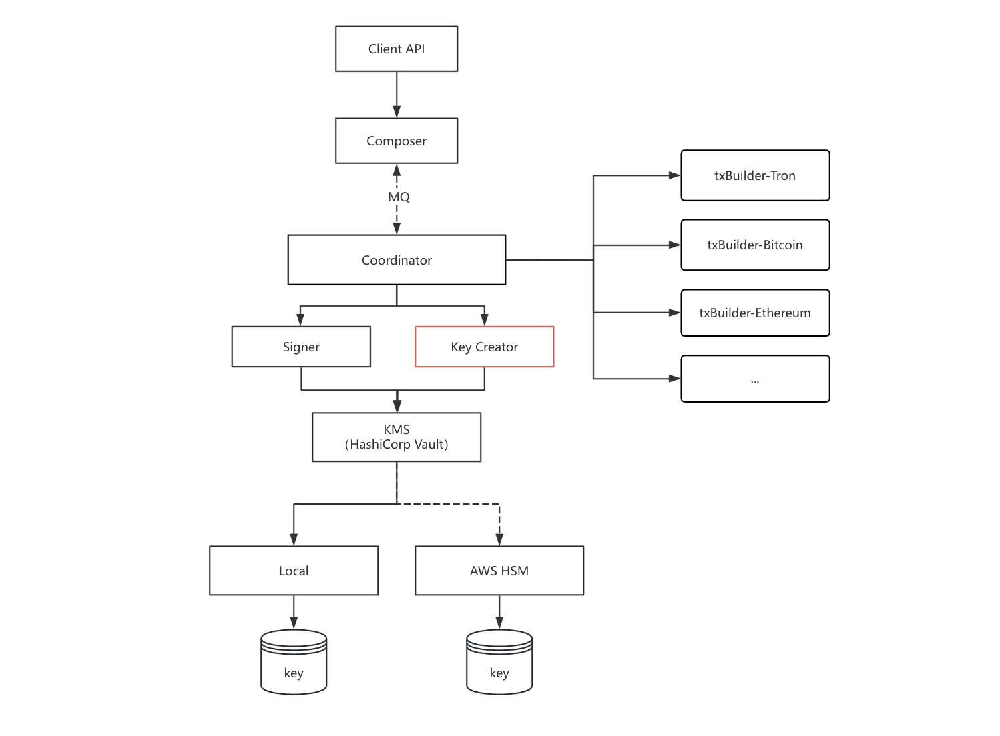

# KeyCreator

## 概述

KeyCreator（密钥生成器）是一个负责 HD 钱包密钥生成与派生的 gRPC 服务。它遵循 BIP-44 标准生成确定性密钥对，并与 KMS（HashiCorp Vault）集成实现密钥的安全加密存储。

**支持的功能**：

- 生成 HD 主密钥种子 (Master Key)
- 派生运营账户密钥 (OPERATIONAL, BIP-44 account=0)
- 派生用户账户密钥 (USER, BIP-44 account=1)
- 批量派生子密钥

**支持的密钥类型**：

- `ecdsa-secp256k1` (ECDSA with secp256k1 curve)
- `ecdsa-secp256r1` (ECDSA with secp256r1/P-256 curve)
- `eddsa-ed25519` (EdDSA with Ed25519 curve)



**工作原理**：

KeyCreator 基于 BIP-44 HD 密钥派生标准，通过以下流程生成密钥：

1. 生成随机 BIP-32 主密钥种子
2. 从种子派生出 `m/44'/coinType'/0'/0/0` (运营密钥) 和 `m/44'/coinType'/1'/0/0` (用户密钥)
3. 使用 HashiCorp Vault Transit Engine 对所有私钥进行加密存储
4. 后续密钥派生时，从 Vault 解密父密钥，派生子密钥后重新加密

**安全特性**：

- **内存安全**：所有私钥明文仅在 KeyCreator 内存中短暂存在，操作完成后立即擦除
- **Vault 加密**：所有密钥使用 Vault Transit Engine 加密存储
- **mTLS 认证**：gRPC 通信使用双向 TLS 认证
- **幂等操作**：密钥创建操作具有幂等性，重复创建不会产生错误

---


## 目录结构

```
internal/key-creator/
├── cmd/key-creator/
│   └── main.go                # 入口程序
├── config/
│   └── config.go              # 配置加载与校验
├── grpc/
│   └── service.go             # gRPC 服务实现
├── kms/
│   └── service.go             # Vault KMS 服务集成
└── infra/setup/
    └── setup.go               # 依赖注入与初始化
```

**Proto 文件**: `proto/keycreator.proto`

**配置文件**: `config/keycreator.toml`

**gRPC 服务地址**: `127.0.0.1:50053`

**认证方式**: mTLS 双向认证（服务端和客户端证书复用）

---


## 1. gRPC 接口


### 1.1 服务定义

```protobuf
service KeyCreator {
  // 健康检查
  rpc HealthCheck(HealthCheckRequest) returns (HealthCheckResponse);

  // 生成核心主密钥
  // 生成 HD 主密钥种子及其派生的核心密钥 (OPERATIONAL 和 USER)
  rpc Genesis(GenesisRequest) returns (GenesisResponse);

  // 创建运营密钥
  // 从核心运营密钥派生指定数量的子密钥
  rpc CreateOperationalKey(CreateKeyRequest) returns (CreateKeyResponse);

  // 创建用户密钥
  // 从核心用户密钥派生指定数量的子密钥
  rpc CreateUserKey(CreateKeyRequest) returns (CreateKeyResponse);
}
```

---


### 1.2 接口说明


#### 1.2.1 健康检查

**功能**: 检查服务运行状态

```protobuf
message HealthCheckRequest {}
message HealthCheckResponse { string status = 1; }
```

**响应示例**:

```json
{
    "status": "ok"
}
```

---


#### 1.2.2 Genesis 初始化

**功能**: 生成区块链钱包的主密钥种子，以及派生的运营密钥和用户密钥。所有密钥使用 Vault Transit Engine 加密后返回。

**前置条件**: 该链尚未初始化

**请求**:

```protobuf
message GenesisRequest {
  string trace_id = 1;   // 链路跟踪 ID，必填
  string chain_code = 2; // 区块链名称，如 bitcoin、ethereum、tron，1-36 必填
  string key_type = 3;   // 密钥类型，如 ecdsa-secp256k1、ecdsa-secp256r1、eddsa-ed25519，1-36 必填
}
```

**响应**:

```protobuf
message GenesisResponse {
  string bip32key_ciphertext = 1; // 加密后的 BIP-32 主密钥密文 (base64)
  string context = 2;            // 密钥派生上下文标识符
  string bip44_path = 3;          // BIP-44 路径字符串，如 m/44'/60'/0'
  repeated DerivedCoreKey derived_keys = 4; // 派生的核心密钥列表
}

message DerivedCoreKey {
  uint32 key_usage = 1;           // 0=运营密钥，1=用户密钥
  string bip32key_ciphertext = 2; // 加密后的密钥密文 (base64)
  string context = 3;            // 密钥派生上下文标识符
  string bip44_path = 4;         // BIP-44 路径字符串
}
```

**BIP-44 派生路径说明**:


| 密钥类型        | BIP-44 路径                | 用途       |
| ----------- | ------------------------ | -------- |
| Master Key  | `m/44'/coinType'/0'`     | HD 主密钥种子 |
| OPERATIONAL | `m/44'/coinType'/0'/0/0` | 运营账户密钥   |
| USER        | `m/44'/coinType'/1'/0/0` | 用户账户密钥   |


其中 `coinType` 根据链代码确定：Bitcoin=0, Ethereum=60, Tron=195 等。

**请求示例**:

```bash
grpcurl -plaintext -d '{"trace_id":"tx-001","chain_code":"ethereum","key_type":"ecdsa-secp256k1"}' \
  localhost:50053 keycreator.KeyCreator/Genesis
```

**响应示例**:

```json
{
    "bip32key_ciphertext": "vault:v1:abc123...",
    "context": "m-44-60-0",
    "bip44_path": "m/44'/60'/0'",
    "derived_keys": [
        {
            "key_usage": 0,
            "bip32key_ciphertext": "vault:v1:def456...",
            "context": "m-44-60-0-0",
            "bip44_path": "m/44'/60'/0'/0/0"
        },
        {
            "key_usage": 1,
            "bip32key_ciphertext": "vault:v1:ghi789...",
            "context": "m-44-60-1-0",
            "bip44_path": "m/44'/60'/1'/0/0"
        }
    ]
}
```

---


#### 1.2.3 创建运营密钥

**功能**: 从核心运营密钥 (`m/44'/coinType'/0'/0/0`) 派生子密钥，用于平台运营相关交易。

**请求**:

```protobuf
message CreateKeyRequest {
  string trace_id = 1;              // 链路跟踪 ID，必填
  string chain_code = 2;            // 区块链名称，1-36 必填
  string bip44_path = 3;            // BIP-44 路径，必须指向运营账户 (account=0)
  uint32 account_index_start = 4;   // 账户索引开始位置，包含当前值
  uint32 count = 5;                // 派生密钥数量，范围 1-50
  string bip32key_ciphertext = 6;  // 父密钥密文 (base64)，Genesis 返回的运营密钥
  string key_type = 7;             // 密钥类型，1-36 必填
}
```

**响应**:

```protobuf
message CreateKeyResponse {
  repeated DerivedChildKey keys = 1; // 派生的子密钥列表
}

message DerivedChildKey {
  string priv_key_ciphertext = 1; // 加密后的私钥 (PKCS8 DER, base64)
  string public_key = 2;        // 公钥 (PKIX PEM 格式)
  uint32 address_index = 3;     // 地址索引
  string context = 4;           // 密钥派生上下文标识符
  string bip44_path = 5;        // BIP-44 路径字符串
}
```

**请求示例**:

```bash
grpcurl -plaintext -d '{
  "trace_id": "tx-002",
  "chain_code": "ethereum",
  "bip44_path": "m/44'\''/60'\''/0'\''/0/0",
  "account_index_start": 0,
  "count": 5,
  "bip32key_ciphertext": "vault:v1:def456...",
  "key_type": "ecdsa-secp256k1"
}' localhost:50053 keycreator.KeyCreator/CreateOperationalKey
```

**响应示例**:

```json
{
    "keys": [
        {
            "priv_key_ciphertext": "vault:v1:abc...",
            "public_key": "-----BEGIN PUBLIC KEY-----\nMCowBQYDK2VwAyEA...\n-----END PUBLIC KEY-----",
            "address_index": 0,
            "context": "m-44-60-0-0-0",
            "bip44_path": "m/44'/60'/0'/0/0"
        }
    ]
}
```

---


#### 1.2.4 创建用户密钥

**功能**: 从核心用户密钥 (`m/44'/coinType'/1'/0/0`) 派生子密钥，用于用户相关交易。

**请求参数** 与创建运营密钥相同，但 `bip44_path` 必须指向用户账户 (account=1)。

**请求示例**:

```bash
grpcurl -plaintext -d '{
  "trace_id": "tx-003",
  "chain_code": "ethereum",
  "bip44_path": "m/44'\''/60'\''/1'\''/0/0",
  "account_index_start": 0,
  "count": 10,
  "bip32key_ciphertext": "vault:v1:ghi789...",
  "key_type": "ecdsa-secp256k1"
}' localhost:50053 keycreator.KeyCreator/CreateUserKey
```

---


### 1.3 客户端调用示例


#### Go 客户端

```go
import (
    proto "github.com/koku-web3/go-koku/pkg/proto/key-creator"
    "google.golang.org/grpc"
    "google.golang.org/grpc/credentials"
)

func main() {
    // TLS 连接配置
    creds := credentials.NewTLS(&tls.Config{
        ServerName: "key-creator",
    })
    conn, err := grpc.Dial("localhost:50053", grpc.WithTransportCredentials(creds))
    if err != nil {
        panic(err)
    }
    defer conn.Close()

    client := proto.NewKeyCreatorClient(conn)
    ctx := context.Background()

    // Genesis 初始化
    genesisResp, err := client.Genesis(ctx, &proto.GenesisRequest{
        TraceId:   "tx-001",
        ChainCode: "ethereum",
        KeyType:   "ecdsa-secp256k1",
    })
    if err != nil {
        panic(err)
    }
    fmt.Printf("Genesis: bip44_path=%s\n", genesisResp.Bip44Path)

    // 创建运营密钥
    keyResp, err := client.CreateOperationalKey(ctx, &proto.CreateKeyRequest{
        TraceId:            "tx-002",
        ChainCode:          "ethereum",
        Bip44Path:          "m/44'/60'/0'/0/0",
        AccountIndexStart:  0,
        Count:              5,
        Bip32KeyCiphertext: genesisResp.DerivedKeys[0].Bip32KeyCiphertext,
        KeyType:            "ecdsa-secp256k1",
    })
    if err != nil {
        panic(err)
    }
    fmt.Printf("Keys created: %d\n", len(keyResp.Keys))
}
```


#### grpcurl 工具调用

```bash
# 健康检查
grpcurl -plaintext localhost:50053 keycreator.KeyCreator/HealthCheck

# Genesis 初始化
grpcurl -plaintext -d '{"trace_id":"tx-001","chain_code":"ethereum","key_type":"ecdsa-secp256k1"}' \
  localhost:50053 keycreator.KeyCreator/Genesis

# 创建运营密钥
grpcurl -plaintext -d '{
  "trace_id": "tx-002",
  "chain_code": "ethereum",
  "bip44_path": "m/44'\''/60'\''/0'\''/0/0",
  "account_index_start": 0,
  "count": 5,
  "bip32key_ciphertext": "vault:v1:...",
  "key_type": "ecdsa-secp256k1"
}' localhost:50053 keycreator.KeyCreator/CreateOperationalKey

# 创建用户密钥
grpcurl -plaintext -d '{
  "trace_id": "tx-003",
  "chain_code": "ethereum",
  "bip44_path": "m/44'\''/60'\''/1'\''/0/0",
  "account_index_start": 0,
  "count": 10,
  "bip32key_ciphertext": "vault:v1:...",
  "key_type": "ecdsa-secp256k1"
}' localhost:50053 keycreator.KeyCreator/CreateUserKey
```

---


## 2. Vault Transit Engine 密钥命名

Vault Transit Engine 使用以下密钥命名规范：


| 密钥类型       | Transit 引擎   | 密钥名称格式              | 示例                   |
| ---------- | ------------ | ------------------- | -------------------- |
| Core       | `core`       | `{chain}-masterkey` | `ethereum-masterkey` |
| Operations | `operations` | `{chain}-privkey`   | `ethereum-privkey`   |
| User       | `user`       | `{chain}-privkey`   | `ethereum-privkey`   |


---


## 3. 安全标准

KeyCreator 遵循 FINANCE 安全标准：

1. **私钥明文保护**：所有私钥明文仅在 KeyCreator 内存中短暂存在
2. **内存清零**：使用 `securestore.Memzero`* 函数在函数返回前清零敏感数据
3. **SecurePrivateKey**：自动在垃圾回收时清零私钥内存
4. **Vault 加密**：所有密钥使用 Vault Transit Engine 加密存储
5. **幂等操作**：密钥创建操作具有幂等性

