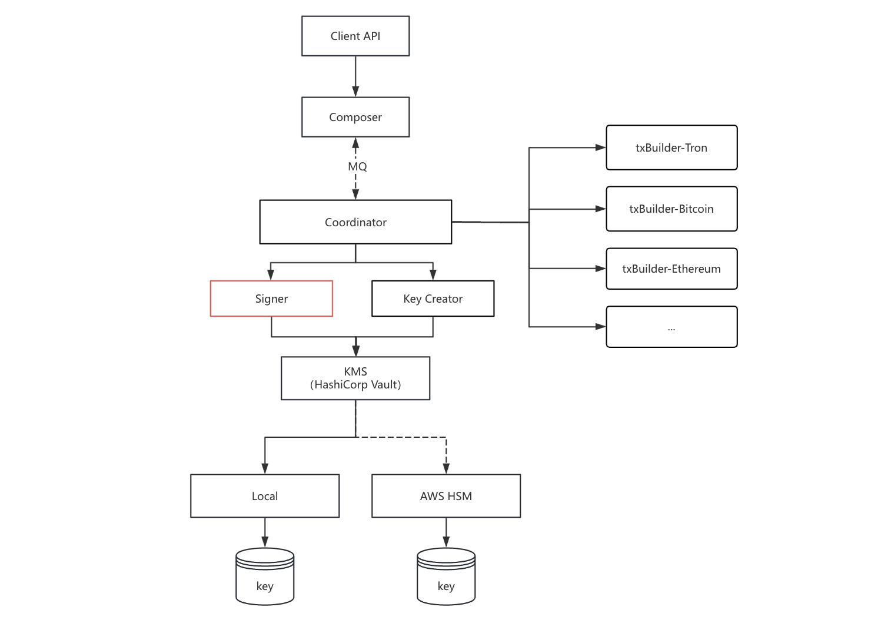

# Signer

## 概述

Signer 是签名服务，负责区块链交易的签名操作。它的职责很单一：使用指定的签名算法签名，不需要了解链相关的任何信息。

**核心能力**：

- 支持 BIP-44 路径派生，按 Account 分离密钥用途
- 支持多种签名算法：ECDSA-secp256k1、ECDSA-secp256r1、EdDSA-Ed25519、SM2，支持扩展新的签名算法
- 私钥明文仅在签名瞬间存在于内存，签名完成后立即擦除
- 支持 mTLS 双向认证（服务端和客户端证书复用）



**工作原理**：

Signer 由 Coordinator 调用，完成区块链交易签名的最后一步：

1. **Coordinator** 协调 TxBuilder 构造交易，得到代签名数据，并从数据库查询私钥密文和 DEK（Data Encryption Key） 密文
2. **Signer** 接收签名请求，调用 KMS（Vault Transit Engine）解密 DEK，再用 DEK 解密私钥信封
3. **Signer** 使用对应算法签名，私钥明文用完后立即擦除内存
4. **Signer** 返回签名结果给 Coordinator
5. **Coordinator** 将签名数据回传 TxBuilder 广播交易

**其他特性**：

- Vault Transit Engine：使用 BIP-44 路径作为 context 进行密钥的派生
- AWS IAM 认证：Signer 与 Vault 之间通过 IAM 身份认证
- 审计追踪：所有签名操作记录 TraceID，便于全链路追踪

---


## 目录结构

```
internal/signer/
├── config/
│   └── config.go           # 配置加载与校验
├── grpc/
│   └── service.go           # gRPC Server 实现
├── kms/
│   └── service.go           # Vault KMS 封装（解密私钥）
└── infra/
    └── setup/
        └── setup.go        # 依赖注入与初始化（Wire 函数）
```

**Proto 文件**: `proto/signer.proto`

**gRPC 服务地址**: `{host}:{port}`

**认证方式**: mTLS 双向认证（服务端和客户端证书复用，默认强制开启 TLS）

---
> 注意：在开始前，请确认 KMS 服务器已部署成功。未部署请转到[HashiCorp Vault 部署与配置](../kms-vault/README.md)。


## 1. gRPC 接口


### 1.1 服务定义

```protobuf
service Signer {
  // 健康检查
  rpc HealthCheck(HealthCheckRequest) returns (HealthCheckResponse);

  // 使用 BIP44 路径 Account=0(运营密钥) 的子密钥签名消息
  // 场景：归集、出账
  rpc SignAcct0(SignRequest) returns (SignResponse);

  // 使用 BIP44 路径 Account=1(用户密钥) 的子密钥签名消息
  // 场景：归集
  rpc SignAcct1(SignRequest) returns (SignResponse);
}
```

---


### 1.2 接口说明


#### 1.2.1 健康检查

**功能**: 检查服务运行状态

```protobuf
message HealthCheckRequest {}
message HealthCheckResponse { string status = 1; }
```

**响应示例**:

```json
{
    "status": "ok"
}
```

---


#### 1.2.2 SignAcct0 运营密钥签名

**功能**: 使用 BIP-44 路径 Account=0 的子密钥对消息签名。用于归集、出账等运营场景。

**请求**:

```protobuf
message SignRequest {
  string trace_id = 1;              // 链路跟踪 ID，1-36 必填
  string chain_code = 2;            // 区块链代码，1-36 必填
  string bip44_path = 3;           // BIP-44 路径字符串，格式：m/44'/60'/0'/0/0
  string key_type = 4;             // 密钥类型，如 ecdsa-secp256k1、ecdsa-secp256r1、eddsa-ed25519，1-36 必填
  string message = 5;               // 待签名数据（十六进制格式），1-1024 必填
  string priv_key_ciphertext = 6;    // 私钥信封密文 (base64: nonce || encrypted)，1-1024 必填
  string dek_ciphertext = 7;        // DEK 密文 (vault:v1:...)，必填
}
```

**响应**:

```protobuf
message SignResponse {
  string signature = 1;            // 已签名数据，返回十六进制格式
}
```

**请求示例**:

```bash
grpcurl -plaintext -d '{
  "trace_id": "tx-001",
  "chain_code": "ethereum",
  "bip44_path": "m/44'\''/60'\''/0'\''/0/0",
  "key_type": "ecdsa-secp256k1",
  "message": "1a2b3c4d5e6f...",
  "priv_key_ciphertext": "YWJjZGVmZ2hpamtsbW5vcA==...",
  "dek_ciphertext": "vault:v1:ABC123..."
}' localhost:50052 signer.Signer/SignAcct0
```

**响应示例**:

```json
{
    "signature": "3045022100..."
}
```

---


#### 1.2.3 SignAcct1 用户密钥签名

**功能**: 使用 BIP-44 路径 Account=1 的子密钥对消息签名。用于归集等用户场景。

**请求参数** 与 SignAcct0 相同。

**请求示例**:

```bash
grpcurl -plaintext -d '{
  "trace_id": "tx-002",
  "chain_code": "ethereum",
  "bip44_path": "m/44'\''/60'\''/1'\''/0/0",
  "key_type": "ecdsa-secp256k1",
  "message": "7a8b9c0d...",
  "priv_key_ciphertext": "b25lIHR3byB0aHJlZSBmb3Vy...",
  "dek_ciphertext": "vault:v1:XYZ789..."
}' localhost:50052 signer.Signer/SignAcct1
```

---


### 1.3 客户端调用示例


#### Go 客户端

```go
import (
    "crypto/tls"

    proto "github.com/koku-web3/go-koku/pkg/proto/signer"
    "google.golang.org/grpc"
    "google.golang.org/grpc/credentials"
)

func main() {
    // TLS 连接配置
    creds := credentials.NewTLS(&tls.Config{
        ServerName: "signer",
    })
    conn, err := grpc.Dial("localhost:50052", grpc.WithTransportCredentials(creds))
    if err != nil {
        panic(err)
    }
    defer conn.Close()

    client := proto.NewSignerClient(conn)
    ctx := context.Background()

    // 健康检查
    healthResp, err := client.HealthCheck(ctx, &proto.HealthCheckRequest{})
    if err != nil {
        panic(err)
    }
    fmt.Printf("Health: %s\n", healthResp.Status)

    // 使用运营密钥签名（Account=0）
    signResp, err := client.SignAcct0(ctx, &proto.SignRequest{
        TraceId:            "tx-001",
        ChainCode:          "ethereum",
        Bip44Path:          "m/44'/60'/0'/0/0",
        KeyType:            "ecdsa-secp256k1",
        Message:            "1a2b3c4d5e6f...",
        PrivKeyCiphertext:  "YWJjZGVmZ2hpamtsbW5vcA==...",
        DekCiphertext:      "vault:v1:ABC123...",
    })
    if err != nil {
        panic(err)
    }
    fmt.Printf("Signature: %s\n", signResp.Signature)

    // 使用用户密钥签名（Account=1）
    signResp, err = client.SignAcct1(ctx, &proto.SignRequest{
        TraceId:            "tx-002",
        ChainCode:          "ethereum",
        Bip44Path:          "m/44'/60'/1'/0/0",
        KeyType:            "ecdsa-secp256k1",
        Message:            "7a8b9c0d...",
        PrivKeyCiphertext:  "b25lIHR3byB0aHJlZSBmb3Vy...",
        DekCiphertext:      "vault:v1:XYZ789...",
    })
    if err != nil {
        panic(err)
    }
    fmt.Printf("Signature: %s\n", signResp.Signature)
}
```


#### grpcurl 工具调用

```bash
# 健康检查
grpcurl -plaintext localhost:50052 signer.Signer/HealthCheck

# 运营密钥签名（Account=0）
grpcurl -plaintext -d '{
  "trace_id": "tx-001",
  "chain_code": "ethereum",
  "bip44_path": "m/44'\''/60'\''/0'\''/0/0",
  "key_type": "ecdsa-secp256k1",
  "message": "1a2b3c4d5e6f...",
  "priv_key_ciphertext": "YWJjZGVmZ2hpamtsbW5vcA==...",
  "dek_ciphertext": "vault:v1:ABC123..."
}' localhost:50052 signer.Signer/SignAcct0

# 用户密钥签名（Account=1）
grpcurl -plaintext -d '{
  "trace_id": "tx-002",
  "chain_code": "ethereum",
  "bip44_path": "m/44'\''/60'\''/1'\''/0/0",
  "key_type": "ecdsa-secp256k1",
  "message": "7a8b9c0d...",
  "priv_key_ciphertext": "b25lIHR3byB0aHJlZSBmb3Vy...",
  "dek_ciphertext": "vault:v1:XYZ789..."
}' localhost:50052 signer.Signer/SignAcct1
```

---


## 2. 签名流程详解


### 2.1 签名流程

```
1. 接收 SignRequest（含 chainCode、bip44Path、keyType、message、privKeyCiphertext、dekCiphertext）
2. 通过 keyType 获取对应的算法服务（algorithm）
3. 通过 KMS.DecryptDataKey 解密 DEK ciphertext 获取 DEK plaintext
4. 解析 privKeyCiphertext 信封: base64(nonce || encrypted)
5. 使用 DEK plaintext + AES-256-GCM 解密私钥
6. 使用 algorithm 算法服务对消息进行签名
7. 立即清零私钥明文内存（Memzero + ClearPrivateKey）
8. 返回签名结果（十六进制格式）
```


### 2.2 支持的密钥类型


| key_type        | 算法    | 说明         |
| --------------- | ----- | ---------- |
| ecdsa-secp256k1 | ECDSA | 比特币、以太坊    |
| ecdsa-secp256r1 | ECDSA | NIST P-256 |
| eddsa-ed25519   | EdDSA | Ed25519    |
| sm2             | SM2   | 国密         |


---


## 3. 安全设计


### 3.1 密钥安全

- **最小暴露原则**：私钥明文仅在签名瞬间存在于内存，签名完成后立即清零
- **内存清零**：使用 `Memzero` 和 `ClearPrivateKey` 双重清零敏感数据
- **信封加密**：使用 Vault datakey + AES-256-GCM 解密，无需暴露 DEK
- **BIP-44 派生**：支持无限子密钥派生，无需暴露主密钥


### 3.2 传输安全

- **gRPC over TCP**：服务间通信
- **mTLS 双向认证**：服务端和客户端证书复用（默认强制开启）
- **AWS IAM 认证**：Signer 与 Vault 之间通过 IAM 身份认证


### 3.3 审计追踪

- **TraceID**：全链路追踪每一个签名请求
- **请求日志**：记录签名方法名、chainCode、bip44Path 等关键信息（私钥内容不记录）

